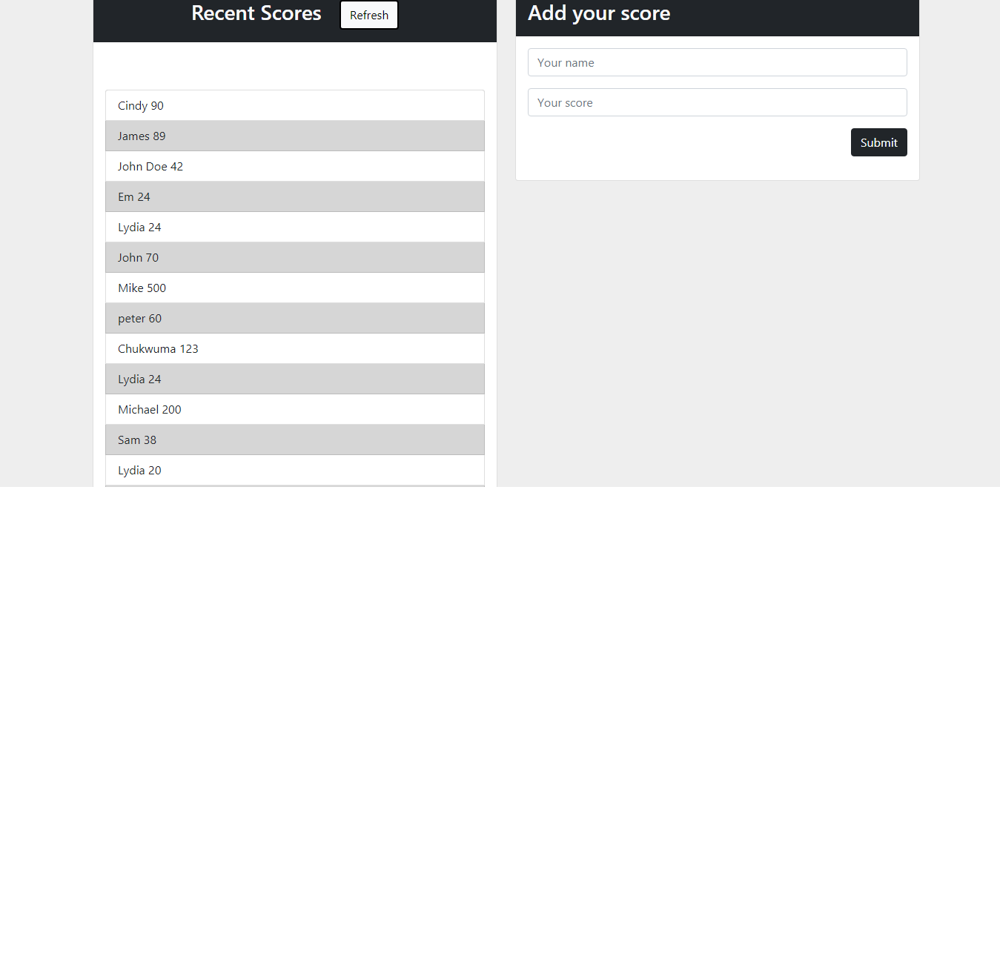

# Leaderboard with API

> Welcome to my leaderboard project, this is an interactive leaderboard excercise from Microverse.



## Built With

- HTML + CSS + Bootstrap + Javascript + Webpack

## Getting Started

* You will not need additional instructions on installing Prerequisites.
* In case you have node_modules on your folder Add them to .gitignore file before you a push.

### Prerequisites

* No prerequisites needed for this project.
### Installation

1. Clone the repo
   ```
   git clone https://github.com/ccobasi/leaderboard.git
   ```
2. Install NPM packages
   ```
   npm install
   ```

### Usage

In order to see the live demo and use the program please run the following command:

```npm run build```

```npm start```

## Author

👤 **Chukwuma Obasi**

- GitHub: [Chukwuma Obasi](https://github.com/ccobasi)
- Twitter: [Chukwuma Obasi](https://twitter.com/obasichux)
- LinkedIn: [Chukwuma Obasi](https://www.linkedin.com/in/chukwuma-obasi/)

## 🤝 Contributing

Contributions, issues, and feature requests are welcome!

Feel free to check the [issues page](https://github.com/ccobasi/leaderboard/issues).


## 👋 Acknowledgements

[Microverse](https://www.microverse.org). 

## Show your support


